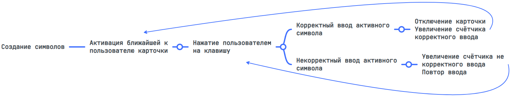
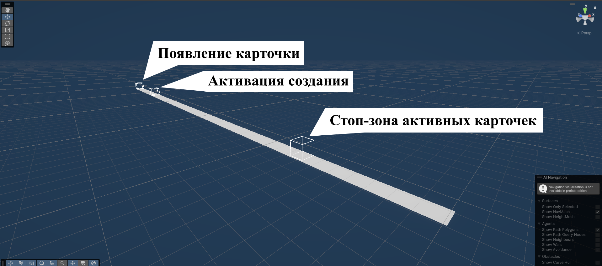
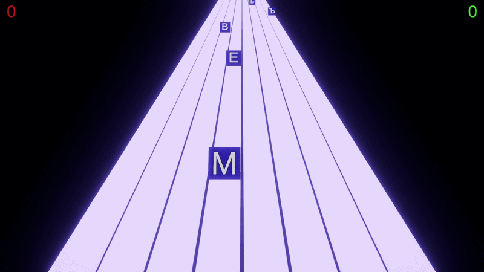
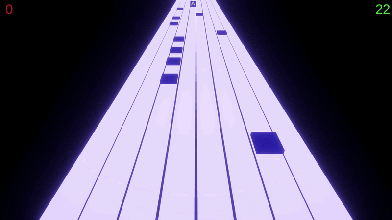
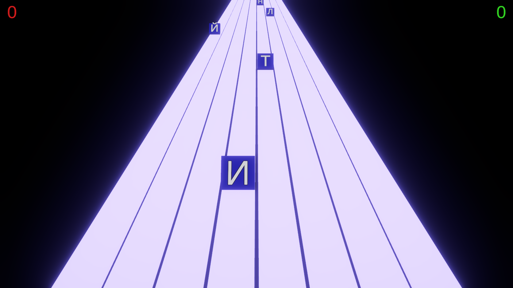
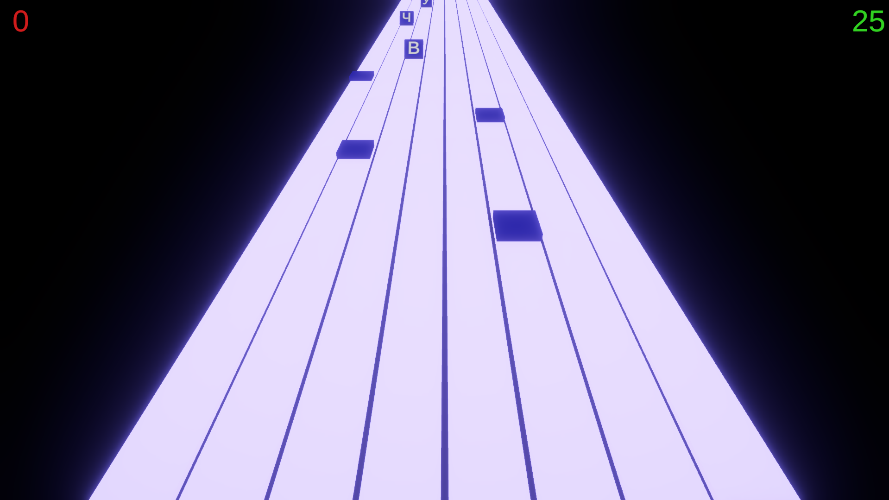
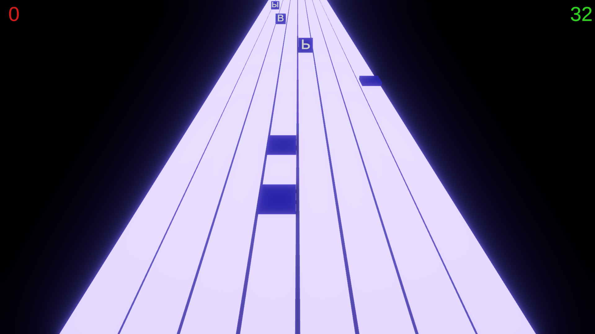
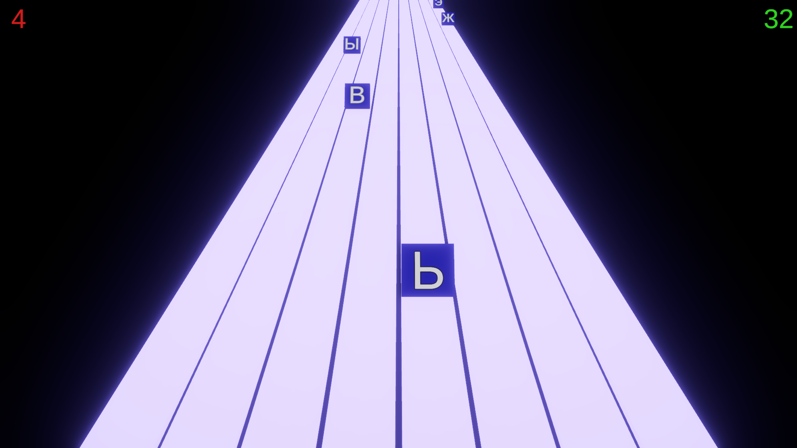

# Тренажёр для отработки навыков слепой печати

**В проекте использовалось:** 
* Unity 6000.0.29f1

**Архитектура данного проекта базируется на глобальных событиях:**
- Событие нажатия клавиши
- Событие корректного ввода
- Событие некорректного ввода
  

Технически эти события выполнены в виде поля UnityEvent в Scriptable Object.

Вызов этих событий происходит из компонентов, например компонент CharInput перехватывает системные события, и если клавиша события есть в словаре, то вызывает "Событие нажатия клавиши" в соответствующем Scriptable Object. Инкапсуляция здесь нарушается намеренно, для упрощения архитектуры.

# _Приложение 1_

Снимки экрана работающего тренажёра

Программа разработана в рамках итогового проекта.